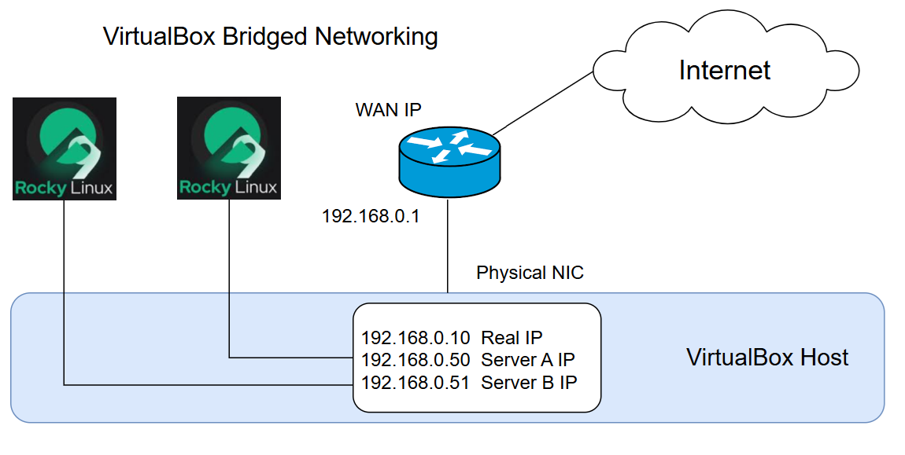
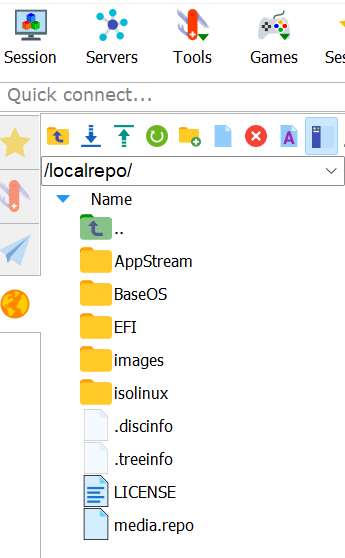
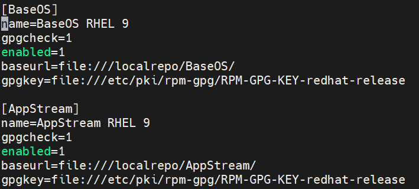
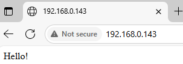
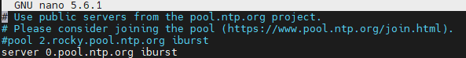
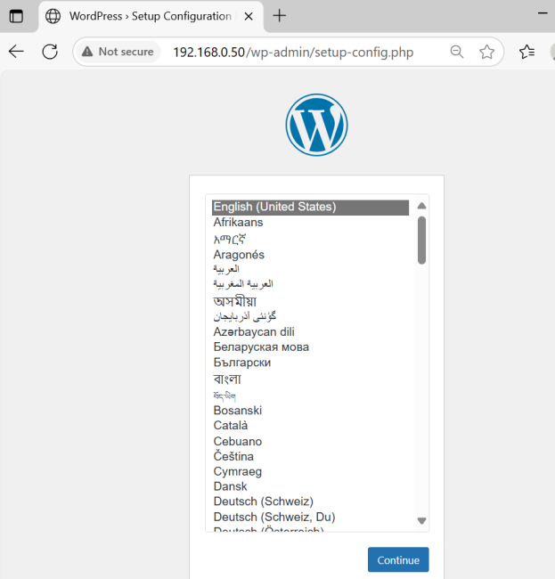
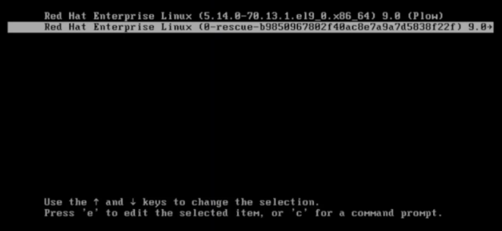
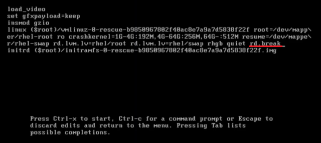
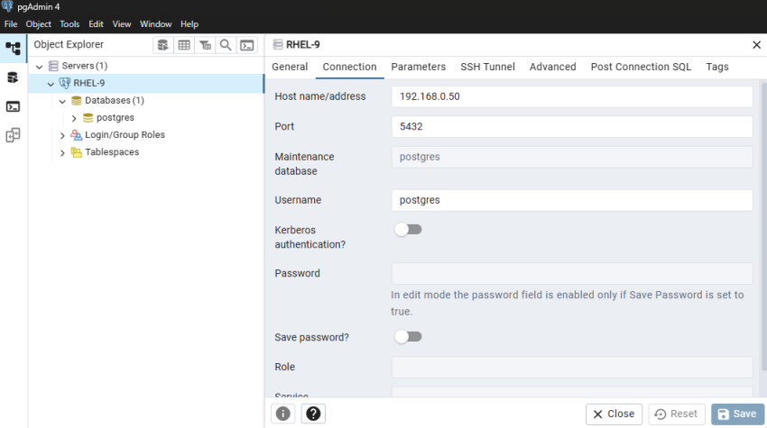

This repository will provide solutions to the Red Hat Certified Systems Administrator (RHCSA EX200 ) exam preparation tasks. Tasks will be executed using Rocky Linux 9 systems in an Oracle VirtualBox environment.

  

# Question 1 

Renaming servers and assigning IP addresses:

Server A:
```bash
su -
hostnamectl set-hostname server-a
nmcli connection show
nmcli con modify "enp0s2" ipv4.method manual ipv4.addresses "192.168.0.50/24" ipv4.gateway 192.168.0.1 ipv4.dns 8.8.8.8
nmcli con up "enp0s2"
```
Server B:
```bash
su -
hostnamectl set-hostname server-b
nmcli connection show
nmcli con modify "enp0s2" ipv4.method manual ipv4.addresses "192.168.0.51/24" ipv4.gateway 192.168.0.1 ipv4.dns 8.8.8.8
nmcli con up "enp0s2"
```

# Question 2 
Configuring a local DNF repository on Server A using the Rocky-9.6-x86_64-dvd image.

Mount ISO on RHEL 9:
```bash
lsblk
```
  

```bash
mkdir /localrepo
mount /dev/sr0 /localrepo/
```
Checking if ISO is available:
```bash
df -h
```
  
  

Repository file configuration:  
```bash
vi /etc/yum.repos.d/rhel9.repo 
```
  

Clearing the cache and refreshing the repository list:
```bash
dnf clean
dnf repolist
```
Checking the repository's functionality by installing the package:
```bash
dnf search httpd
```
Automatically mount the ISO on system startup. Add in file /etc/fstab:  
/dev/sr0 /localrepo/ iso9660 ro,loop,user 0 0 

# Question 3 
Web server configuration with welcome message on Server A

Checking the current firewall configuration:

```bash
firewall-cmd --list-all
```

Apache installation:
```bash
dnf install httpd -y
```

Starting and enabling the service:
```bash
systemctl start httpd
systemctl enable httpd
```

Creating a welcome page:
Adding a greeting - Hello!  
`# vi /var/www/html/index.html`  
```bash
Hello!
```
Permanently opening HTTP and HTTPS ports in the firewall and reloading:
```bash
firewall-cmd --add-service=http --permanent
firewall-cmd --add-service=https --permanent
firewall-cmd --reload
```
Test:  
  

# Question 4 
Set the time zone to "Europe/Copenhagen" on Server A

Checking the current time zone:
```bash
timedatectl status
timedatectl set-timezone "Europe/Copenhagen"
```
# Question 5 
Configuring NTP time synchronization on Server A.

Editing the Chrony configuration file:
`vi /etc/chrony.conf`
```bash
server 0.pool.ntp.org iburs
```
  
Enable NTP synchronization:
```bash
timedatectl set-ntp true
```
Restarting the chronyd service:
```bash
systemctl restart chronyd
```
Checking the NTP source:
```bash
systemctl restart chronyd
```

# Question 6 
Running a Wordpress container with Podman on Server A.

 Run a WordPress container in detached mode with the name "hello-wordpress" using podman. Mount the
 “/home/wordpress/var/www/html/” directory in the host to the “/var/www/html” directory in the podman container. Map TCP port 80 in the container to port 80 on the host.  

```bash
 dnf install container-tools -y
 podman search wordpress
 podman pull docker.io/library/wordpress
 podman tag docker.io/library/wordpress localhost/wordpress
 systemctl stop httpd 
 mkdir -p /home/wordpress/var/www/html
 podman run --name hello-wordpress -d -v /home/wordpress/var/www/html/:/var/www/html:Z -p 80:80 localhost/wordpress
 podman ps
 sudo firewall-cmd --list-ports
```
If there is a port:  
80/tcp

The firewall allows network traffic to port 80. If there is no port, then:
```bash
 firewall-cmd --add-port=80/tcp --permanent
 firewall-cmd --reload
 firewall-cmd --list-all
```

Check in your browser:  
  

# Question 7

Reset the root password on Server B. Change it to "newpassword" to gain access to the system.  

In the boot menu, select the second option and press "e" to edit boot options.
  

Adding rd.break. Save and restart - Ctrl + X  
  

We mount and run the main partition. We set a new password. Create a hidden file named .autorelabel in the root directory. Exit and restart.  

```bash
mount -o remount rw /sysroot
chroot /sysroot
passwd root
touch /.autorelabel
exit
reboot
```


# Question 8 

On ServerB, do the following:
1. Create users Luke, Andrew, Mark and John.
    Luke and Andrew are members of the Innovation group.
    Mark and John are members of the Expert group.
2. Create shared group directories /groups/Innovation and /groups/Expert
3. Make the Innovation group the owner group of the /groups/Innovation directory, and the Expert group the owner group of the /groups/Expert directory.
4. Grant the groups that own the Innovation and Expert directories full access to these directories.
5. Others don't have access to the Innovation and Expert directories
6. New files created in Innovation and Expert directories belong to the group of which the directory is a member.
7. Members of The Expert group have read and execute permissions on the /groups/Innovation directory and all of its sub-directories and files.

```bash
useradd Luke && useradd Andrew && useradd Mark && useradd John
groupadd Innovation && groupadd Expert
usermod -aG Innovation Luke && usermod -aG Innovation Andrew
usermod -aG Expert Mark && usermod -aG Expert John
mkdir -p /groups/Innovation
mkdir -p /groups/Expert
chgrp Innovation /groups/Innovation
chgrp Expert /groups/Expert
chmod g+rwx /groups/Innovation && chmod g+rwx /groups/Expert
chmod o-x /groups/Innovation && chmod o-x /groups/Expert
chmod g+s /groups/Innovation && chmod g+s /groups/Expert
setfacl -Rm g:Expert:r-x /groups/Innovation
getfacl /groups/Innovation
```

# Question 9

On ServerB, set SELinux to "enforcing" mode.
```bash
getenforce
setenforce 1
```

# Question 10

Change the serverB hostname to rhel.server.com and make it persistent.

`vi /etc/hostname`  
and change line to: rhel.server.com

# Question 11

On rhel.server.com, add a new enviroment variable "VAR" with the value "RHCSA Prac Five" which will be available throughout the system, on both remote login session as well as local sessions for all users.

`vi /etc/bashrc`  
and add the line: export VAR="RHCSA Prac Five"  
```bash
source /etc/bashrc  
echo $VAR  
```

# Question 12

On rhel.server.com, configure a permanent storage for "journald" logs with 100 max use.

`vi /etc/systemd/journald.conf`  
uncomment and change line to: Storage=persistent  
and SystemMaxUse=100M
```bash
systemctl restart systemd-journald
reboot
ls /var/log/journal
```

# Question 13

On rhel.server.com, find all regular files in the "/etc" directory that were modified more than 90 days ago and redirect the output to /modified_etc_files.
```bash
find /etc -type f -mtime +90 > /modified_etc_files
```

# Question 14

On rhel.server.com, create a script named "/usr/local/bin/find.sh" to find all files under the directory "/etc" that are less than 4M and have SGID permissions set. Then save the list of found files to /root/4Mfiles.  
vi /usr/local/bin/find.sh

#!/bin/bash  
find /etc -size -4M -perm -g=s > /root/4Mfiles  

```bash
chmod a + x /usr/local/bin/find.sh
/usr/local/bin/find.sh
```
# Question 15

On rhel.server.com, find the word "error" in all files in the current directory and redirect the result to the file "/root.erros"

```bash
grep -r 'error' > /root/errors
```

# Question 16

On ServerA run the PostgreSQL database in a container with Podman and connect remotely.

Container launch:

```bash
podman run -d -p 5432:5432 -e POSTGRES_PASSWORD=postgres postgres
```
-d → works in the background  
-p 5432:5432 → exposes the PostgreSQL port to the system  
-e POSTGRES_PASSWORD=postgres → sets the password for the postgres user  
postgres → official database image  

You check:
```bash
firewall-cmd --list-ports
```
If there is a port:  
5432/tcp

The firewall allows network traffic to port 5432. If there is no port, then:  

```bash
firewall-cmd --add-port=5432/tcp --permanent
firewall-cmd --reload
```
--add-port → opens the port  
--permanent → saves it permanently    
--reload → activates the change immediately    

Remote connection to PostgreSQL database:

  

# Question 17

 On ServerB, as root create a cron job that deletes empty files from /tmp at 12:30 am daily.  
 ```bash
crontab -e
```
Add the line:   
30 0 * * * find /tmp/ -type f -empty -delete // 0 is 12 am

# Question 18

On ServerB, optimize the system to run in a virtual machine for the best performance and concurrently tunes it for low
power consumption. Low power consumption is the priority.
 ```bash
dnf install tuned
systemctl start tuned
tuned-adm list
tuned-adm active
tuned-adm profile virtual-guest powersave
```
# Question 19

On ServerB, all new users should have a file name “YouDidIt” in their home folder after account creation.

 ```bash
echo "Congratulations!" > /etc/skel/YouDidIt
chmod 644 /etc/skel/YouDidIt
```
# Question 20

Schedule the task to run at 08:00 time on ServerA using the "at" command. You want to create a file named "example.sh" containing a command to create a file "example.txt" in your home directory.

Checking if at is installed:
 ```bash
rpm -q at
```
Install at:
 ```bash
sudo dnf install -y at
systemctl start atd
systemctl enable atd
```
Solving the task:
 ```bash
echo -e '#!/bin/bash\ntouch ~/example.txt' > ~/example.sh
chmod +x ~/example.sh
at 08:00
~/example.sh
# Ctrl + D
```

# Question 21

On ServerB, create a user peter with UID 1450 and expiry date 2026-12-31.  

 ```bash
useradd -u 1450 -e 2026-12-31 peter
chage -l peter
```

# Question 22

On ServerB, copy “/etc/hosts” file to the “/var/” directory with the name "nhosts", then do the following:  
User andrew can read, write, and execute the "nhosts" file.
User john can only read the "nhosts" file.

```bash
cp /etc/hosts /var/nhosts
```

Check if root is the owner:  
```bash
ls -l /var/nhosts
```
We set the basic settings:  
```bash
chmod 640 /var/nhosts
```
root: read/write  
group: read  
others: no access  

But this does NOT meet the requirements yet (because andrew and john are not included) → we will use ACL.  
  
user andrew: full rights (rwx)  
```bash
setfacl -m u:andrew:rwx /var/nhosts
```
user john: read only  
```bash
setfacl -m u:john:r-- /var/nhosts
```
ACL Explained:  
setfacl → sets Access Control List  
-m → modification  
u:andrews:rwx → user andrew has read/write/execute  
u:john:r-- → user john only has read

# Question 23

 On ServerB, write a script "/sum.sh" that can do the arithmetical operation by giving the sum of two integers entered by any user.

 ```bash
#!/bin/bash

read -p "Enter number 1: " num1
read -p "Enter number 2: " num2

if ! [[ "$num1" =~ ^-?[0-9]+$ && "$num2" =~ ^-?[0-9]+$ ]]; then
    echo "Error: Please enter valid integers"
    exit 1
fi

sum=$((num1 + num2))
echo "Suma: $sum"
 ```

Granting permissions:
```bash
chmod +x /sum.sh
```
Loading data from the user and displaying a message:  
read -p "Enter number 1: " num1  

Checking if these are integers:    

=~ ^-?[0-9]+$  

Script exits with error code:  
exit 1 

# Question 24

On ServerB, search the user frodo data in the “/etc/passwd” file and append the output in “/users/data”.

```bash
mkdir -p /users
grep "^frodo:" /etc/passwd | sudo tee -a /users/data
```

grep → searches for user frodo    
| → forwards the result  
sudo tee -a → writes to file as root  
-a → append (writing)

# Question 25

On ServerB, write a script named “/find_rf.sh” that prints out a list of files owned by root and with the SUID bit set in /usr.

```bash
#!/bin/bash

find /usr -type f -user root -perm -4000 2>/dev/null
```

-type f → only regular files (not directories)    
-user root → files belonging to the root user  
-perm -4000 → files with SUID - 4000 set can be executed as root even if run by a regular user  
2>/dev/null → hides errors  


# Question 26

On ServerB, perform the following tasks:  

1. Grant execute permission to the file owner.
2. Revoke read and write permissions for both group and other users.

Use the file /home/$USER/myFile, which currently has the permissions rw-r--r--.

Execute the following commands:

```bash
touch /home/$USER/myFile
ls -l /home/$USER
stat -c %a /home/$USER/myFile
chmod u+x /home/$USER/myFile
chmod go-rw /home/$USER/myFile
ls -l /home/$USER
```


touch /home/$USER/myFile → Creates a file.  
ls -l /home/$USER → Displays detailed information about files, including their permissions.  
stat -c %a /home/$USER/myFile → Shows permissions in numeric (octal) format, e.g. 644.  
chmod u+x → Adds execute permission (x) for owner (u).  
chmod go-rw → Removes (-) read (r) and write (w) permissions.  


The end result

Permissions will change from:  
```bash
rw-r--r--  (644)
```
to:  
```bash
rwx------  (700)
```


# Question 27

While trying to access the "/home/Passwords" file on ServerA, you received a "Permission Denied" error message. You
suspect there may be a file permission issue. Please diagnose and correct the problem.  
Assuming the following:  
Note  
The user trying to access the file is Frodo.
The file group owner should be admins.  

```bash
chgrp admins /home/Passwords
usermod -aG admins Frodo
chmod 660 /home/Passwords
```

The /home/Passwords file has been assigned to the admins group. Then the user Frodo was added to the admins group. Finally, the file permissions were set.

# Question 28

On ServerA, locate all lines within the "/etc/passwd" file that include the string "test". Create a file named "/root/test" containing exact copies of these lines in their original order, excluding any empty lines.

```bash
grep 'test' /etc/passwd | grep -v '^$' > /root/test
```

| → passes the result on and you create a chain of commands (without | each command works separately)  
grep -v '^$' → filters this result (removes blank lines)  
`>` → overwrites to file (>> writes to file)

# Question 29

On ServerA, scan and analyze the audit.log file for SELinux denials and attempts, and save the results to the
“/audit_log.txt” file. Ensure the analysis provides clear explanations and actionable recommendations for resolving
identified issues.

```bash
sealert -a /var/log/audit/audit.log > /audit_log.txt
```

sealert -a /var/log/audit/audit.log → command:
* detects SELinux denials and policy violation attempts
* provides recommendations

# Question 30

ServerB is running Apache HTTP Server, which needs to access files in the directory: /var/www/html/mydirectory. However, SELinux is currently preventing this access.     
Task:   
Modify the SELinux policy on ServerB to grant Apache HTTP Server access to files in /var/www/html/mydirectory securely, following best practices.     
Additional Considerations:  
This modification should persist after a server reboot.
Minimize the impact on other applications or directories.

```bash
ls -Z /var/www/html
semanage fcontext -a -t httpd_sys_content_t "/var/www/html/mydirectory(/.*)?"
restorecon -Rv /var/www/html/mydirectory
```

The directory had the wrong SELinux context (label). Check the context:
```bash
ls -Z /var/www/html
```
Set the correct SELinux context for Apache:
```bash
semanage fcontext -a -t httpd_sys_content_t "/var/www/html/mydirectory(/.*)?"
```
-a → adds a rule  
-t httpd_sys_content_t → Apache type (read only)  
(/.*)? → includes the directory and all files inside  

Apply changes:
```bash
restorecon -Rv /var/www/html/mydirectory
```
Optionally check if httpd_sys_content_t is present:
```bash
ls -Z /var/www/html/mydirectory
```
# Question 31

On ServerA, find the string blank in "/etc/passwd" and send it to the file "/home/blankword" without removing the file content.

```bash
grep 'blank' /etc/passwd >> /home/blankword
```

# Question 32

 Which of the following command sequences overwrites the file sample.txt?

 ```bash
echo "text" > sample.txt
 ```

 # Question 33

 On ServerB, configure autofs to mount the "/home" directory of the remote NFS server at boot time. The remote NFS server's IP address is "192.168.0.60/24" and the exported directory is "/nfs/home". Ensure that the mount is accessible to all users on the local system.

* Installing packages:  
```bash
dnf install -y autofs nfs-utils
```
* Add an entry to /etc/auto.master:  
```bash
vi /etc/auto.master
```
Entry:  
/home  /etc/auto.home      
* Create a map /etc/auto.home  
```bash
vi /etc/auto.home
```
Wildcard map for every user:    
-rw,sync   192.168.0.60:/export/home/&  
* Run autofs: 
```bash 
systemctl enable --now autofs  
```
* Restart:  
```bash
systemctl restart autofs
```
* Test:  
```bash
cd /home/testuser
```

# Bonus

NFS Server Configuration (Rocky Linux 9) - This is not required for the exam!  

```bash
dnf install -y nfs-utils
mkdir -p /nfs/home
chmod 755 /nfs/home
```
Export configuration:  
```bash
vi /etc/exports
```
Add:  
/nfs/home 192.168.0.0/24(rw,sync,no_root_squash)  

Explanation:  
192.168.0.0/24 → the entire network has access  
rw → read + write  
sync → synchronous writting   
no_root_squash → the root user on the client is not treated as root on the server      

Enabling services:  
```bash
systemctl enable --now nfs-server
```
Loading exports:  
```bash
exportfs -rav
```
Firewall and SELinux:  
```bash
firewall-cmd --permanent --add-service=nfs
firewall-cmd --permanent --add-service=mountd
firewall-cmd --permanent --add-service=rpc-bind
firewall-cmd --reload
setsebool -P nfs_export_all_rw on
```

# Question 34
 On ServerB, install the appropriate kernel update. The following criteria must also be met:
* The updated kernel is the default kernel when the system is rebooted.
* The original kernel remains available and bootable on the system.  

You need to do a standard kernel update, but without removing the old one and make sure the new one is the default one:  
```bash
sudo dnf update kernel
```
Check installed kernels (there should be an old and a new one):  
```bash
rpm -q kernel
```
Check GRUB Entry List:  
```bash
sudo awk -F\' '$1=="menuentry " {print i++ " : " $2}' /etc/grub2.cfg
```
Set the first (latest) kernel as default:  
```bash
sudo grub2-set-default 0
```
Check:  
```bash
grub2-editenv list
```

# Question 35
On ServerB, create a user harry whose UID is 5000, and he doesn't have access to any interactive shell on the system.
```bash
useradd -u 5000 -s /sbin/nologin harry
```
Check the shell:  
```bash
getent passwd harry
```
Command output:  
harry:x:5000:5000::/home/harry:/usr/sbin/nologin

# Question 36
On ServerA,  in the /home/$USER/ directory:
- Create a file file_a.
- Create soft link life_b pointing to file_a.
- Create hard link file_c pointing to file_a.
- Verify all links work.

```bash
touch file_a
ln -s file_a file_b
ln file_a file_c
ls -li
```
Delete the file_a file and check if the links work:  
```bash
rm file_a
cat file_b # broken link
cat file_c # work 
```
# Question 37

On ServerB, a new 20GB disk was added, which is visible as /dev/sdb.
- Create a 15 GB partition on the /dev/sdb drive.
- Add this space to the existing LVM volume group.
- Extend the logical system volume by 15 GB.
- Expand the file system without losing data.
- Ensure that the configuration is persistent and available after a system restart.

```bash
lsblk # Check the disk
fdisk /dev/sdb
# n → new partition
# p → primary
# enter → numer: default
# enter → start: Enter
# +15G → size
# t → change type
# 8e → LVM
# w → save and exit
```
Refresh the system after partition changes:
```bash
partprobe
```
Physical Volume:
```bash
pvcreate /dev/sdb1
```
Add to VG (vgs rl):
```bash
vgextend rl /dev/sdb1
```
Extend Logical Volume + filesystem (XFS):
```bash
lvextend -r -L +15G /dev/rl/root
```
Check:
```bash
df -h
```

# Question 38

On ServerA, create a 200MB swap partition using /dev/sdb that automatically activates at boot.

```bash
sudo fdisk /dev/sdb
# n → new partition
# p → primary
# 1 → partition number
#enter → default first sector
#+200M
#t → type change
#82 → swap code
#w → save and exit
```

Create swap on the new partition:
```bash
sudo mkswap /dev/sdb1
```
Activate swap:
```bash
sudo swapon /dev/sdb1
```
Add an entry to /etc/fstab to activate it on startup:
```bash
# /etc/fstab
/dev/sdb1   swap    swap    defaults    0 0
```
Check:
```bash
sudo swapoff -a
sudo swapon -a
```

# Question 39

Enable IPV6 packet forwarding on ServerB. This should persist after a reboot.

```bash
vi /etc/sysctl.conf
```
Add at the end:  
net.ipv6.conf.all.forwarding=1
```bash
sysctl -p
```

The server now works like a router for IPv6 traffic