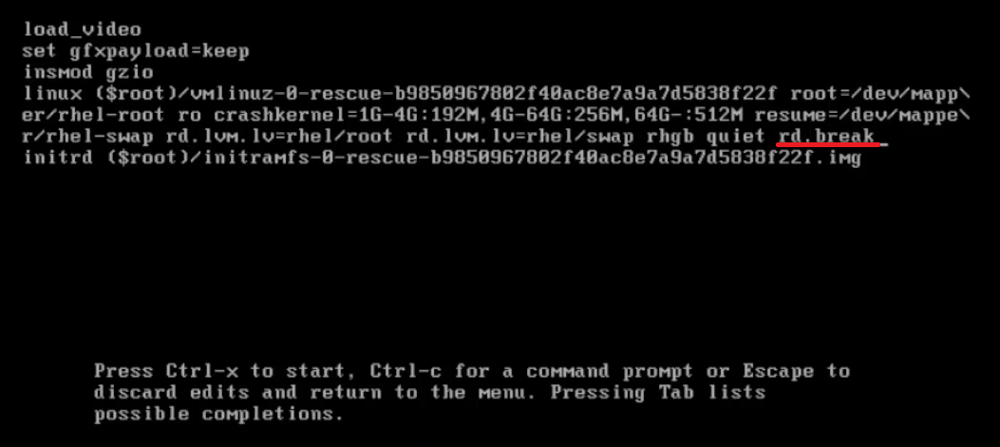
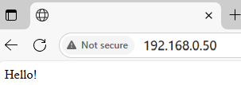
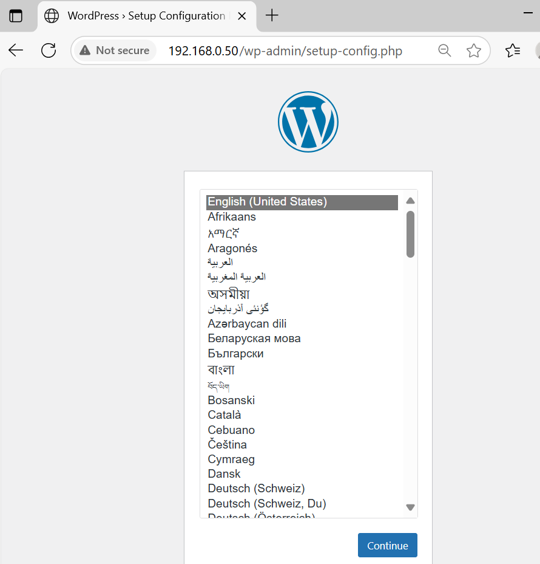

This repository will provide solutions to the Red Hat Certified Systems Administrator (RHCSA EX200 ) exam preparation tasks. Tasks will be executed using Rocky Linux 9 systems in an Oracle VirtualBox environment.

  

# Question 1

Reset the root password on Server B. Change it to "newpassword" to gain access to the system.  

In the boot menu, select the second option and press "e" to edit boot options.
  

Adding rd.break. Save and restart - Ctrl + X
 

We mount and run the main partition. We set a new password. Create a hidden file named .autorelabel in the root directory. Exit and restart.  

```bash
mount -o remount rw /sysroot
chroot /sysroot
passwd root
touch /.autorelabel
exit
reboot
```


# Question 2 

Renaming servers and assigning IP addresses:

Server A:
```bash
su -
hostnamectl set-hostname server-a
nmcli connection show
nmcli con modify "enp0s2" ipv4.method manual ipv4.addresses "192.168.0.50/24" ipv4.gateway 192.168.0.1 ipv4.dns 8.8.8.8
nmcli con up "enp0s2"
```
Server B:
```bash
su -
hostnamectl set-hostname server-b
nmcli connection show
nmcli con modify "enp0s2" ipv4.method manual ipv4.addresses "192.168.0.51/24" ipv4.gateway 192.168.0.1 ipv4.dns 8.8.8.8
nmcli con up "enp0s2"
```

# Question 3 
Configuring a local DNF repository on Server A using the Rocky-9.6-x86_64-dvd image.

Mount ISO on RHEL 9:
```bash
lsblk
```
  

```bash
mkdir /localrepo
mount /dev/sr0 /localrepo/
```
Checking if ISO is available:
```bash
df -h
```
  
  

Repository file configuration:  
```bash
vi /etc/yum.repos.d/rhel9.repo 
```
  

Clearing the cache and refreshing the repository list:
```bash
dnf clean
dnf repolist
```
Checking the repository's functionality by installing the package:
```bash
dnf search httpd
```
Automatically mount the ISO on system startup. Add in file /etc/fstab:  
/dev/sr0 /localrepo/ iso9660 ro,loop,user 0 0 

# Question 4 
Web server configuration with welcome message on Server A

Checking the current firewall configuration:

```bash
firewall-cmd --list-all
```

Apache installation:
```bash
dnf install httpd -y
```

Starting and enabling the service:
```bash
systemctl start httpd
systemctl enable httpd
```

Creating a welcome page:
Adding a greeting - Hello!
vi /var/www/html/index.html


Permanently opening HTTP and HTTPS ports in the firewall and reloading:
```bash
firewall-cmd --add-service=http --permanent
firewall-cmd --add-service=https --permanent
firewall-cmd --reload
```
Test:  
  

# Question 5 
Set the time zone to "Europe/Copenhagen" on Server A

Checking the current time zone:
```bash
timedatectl status
timedatectl set-timezone "Europe/Copenhagen"
```
# Question 6 
Configuring NTP time synchronization on Server A.

Editing the Chrony configuration file:
```bash
# vi /etc/chrony.conf
server 0.pool.ntp.org iburs
```
  
Enable NTP synchronization:
```bash
timedatectl set-ntp true
```
Restarting the chronyd service:
```bash
systemctl restart chronyd
```
Checking the NTP source:
```bash
systemctl restart chronyd
```

# Question 7 
Running a Wordpress container with Podman on Server A.

 Run a WordPress container in detached mode with the name "hello-wordpress" using podman. Mount the
 “/home/wordpress/var/www/html/” directory in the host to the “/var/www/html” directory in the podman container. Map TCP port 80 in the container to port 80 on the host.  

```bash
 dnf install container-tools -y
 podman search wordpress
 podman pull docker.io/library/wordpress
 podman tag docker.io/library/wordpress localhost/wordpress
 systemctl stop httpd 
 mkdir -p /home/wordpress/var/www/html
 podman run --name hello-wordpress -d -v /home/wordpress/var/www/html/:/var/www/html:Z -p 80:80 localhost/wordpress
 podman ps
 firewall-cmd --list-all
 firewall-cmd --add-port=80/tcp --permanent
 firewall-cmd --reload
 firewall-cmd --list-all
```

Check in your browser:  
  


# Question 8 

On ServerB, do the following:
1. Create users Luke, Andrew, Mark and John.
    Luke and Andrew are members of the Innovation group.
    Mark and John are members of the Expert gorup.
2. Create shared group directories /groups/Innovation and /groups/Expert
3. Make the Innovation group the owner group of the /groups/Onnovation directory, and the Expert group the owner group of the /groups/Expert directory.
4. Grant the groups that own the Innovation and Expert direcotires full access to these directories.
5. Others don't have access to the Innovation and Expert directories
6. New files created in Innovation and Expert directories belong to thr group of which the directory is member.
7. Members of The Expert group have read and execute permissions on the /groups/Innovation directory and all of its sub-directories and files.

```bash
useradd Luke && useradd Andrew && useradd Mark && useradd John
groupadd Innovation && groupadd Expert
usermod -aG Innovation Luke && usermod -aG Innovation Andrew
usermod -aG Expert Mark && usermod -aG Expert John
mkdir -p /groups/Innovation
mkdir -p /groups/Expert
chgrp Innovation /groups/Innovation
chgrp Expert /groups/Expert
chmod g+rwx /groups/Innovation && chmod g+rwx /groups/Expert
chmod o-x /groups/Innovation && chmod o-x /groups/Expert
chmod g+s /groups/Innovation && chmod g+s /groups/Expert
setfacl -Rm g:Expert:r-x /groups/Innovation
getfacl /groups/Innovation
```